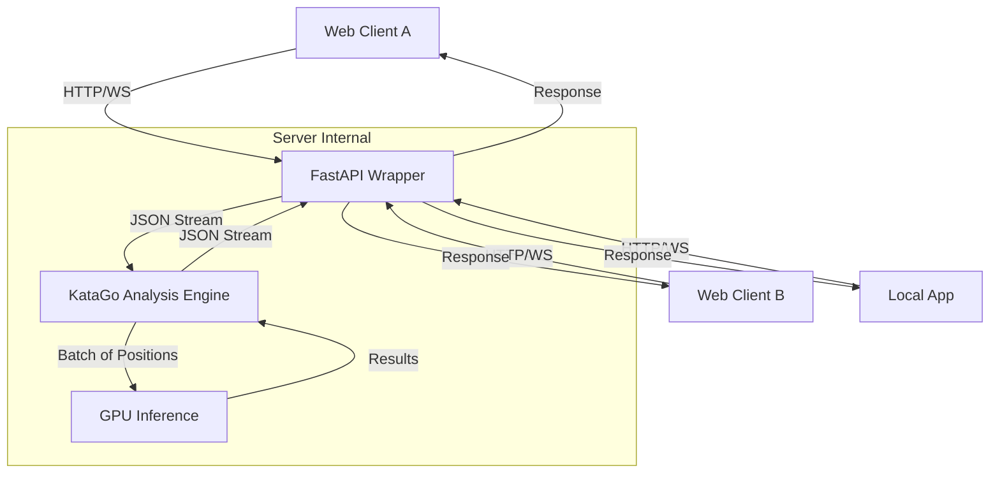

# Revised Architecture & Implementation Plan (Gemini Recommendation)

## 1. Architectural Decision: Single-Process Batch Inference

**Verdict:** Use **KataGo's Internal Batch Inference (Single Process)** instead of a multi-process model pool.

**Rationale:**
1.  **Resource Efficiency:** A single process loads the model weights once (~500MB VRAM). A pool of $N$ processes would consume $N \times 500\text{MB}$, wasting VRAM that could be better used for caching or larger batch sizes.
2.  **Throughput Optimization:** KataGo is explicitly optimized to batch positions from multiple concurrent games into a single GPU request. This saturates the GPU more effectively than multiple processes competing for GPU time slices.
3.  **Simplicity:** The `analysis` mode is inherently an asynchronous server, designed to handle out-of-order request/response streams, making it a perfect fit for an async Python wrapper.

## 2. Architecture Diagram

## 3. Configuration Strategy: "The Middle Ground"

To balance **latency** (snappy feel for users) and **concurrency** (handling multiple users without queuing), we will adopt a "Middle Ground" configuration.

| Parameter | Value | Effect |
| :--- | :--- | :--- |
| `numAnalysisThreads` | **8** | Allows **8 concurrent requests** to be processed simultaneously by the engine. |
| `numSearchThreadsPerAnalysisThread` | **8** | Allocates 8 CPU threads per request. This ensures a response time of ~0.4s-0.8s for 500 visits, keeping the UI responsive. |
| `nnMaxBatchSize` | **64** | (8 * 8 = 64). Ensures the GPU processes **all** active searches in a single batch, maximizing throughput. |

**Performance Trade-off:**
*   **vs. Default (16 threads/req):** Individual responses are slightly slower (~0.2s -> ~0.5s), but we can handle 8x the traffic without queuing.
*   **vs. Max Concurrency (1 thread/req):** We avoid the "slow" feeling of 1-thread search, providing a good user experience while still supporting multi-tenancy.

## 4. Implementation Plan

1.  **Create Server Config:** Create `cpp/configs/server_analysis.cfg` with the optimized threading parameters.
2.  **Update App Config:** Modify `config.yaml` to point to the new `server_analysis.cfg`.
3.  **Restart Service:** The Python application will pick up the new configuration on restart.